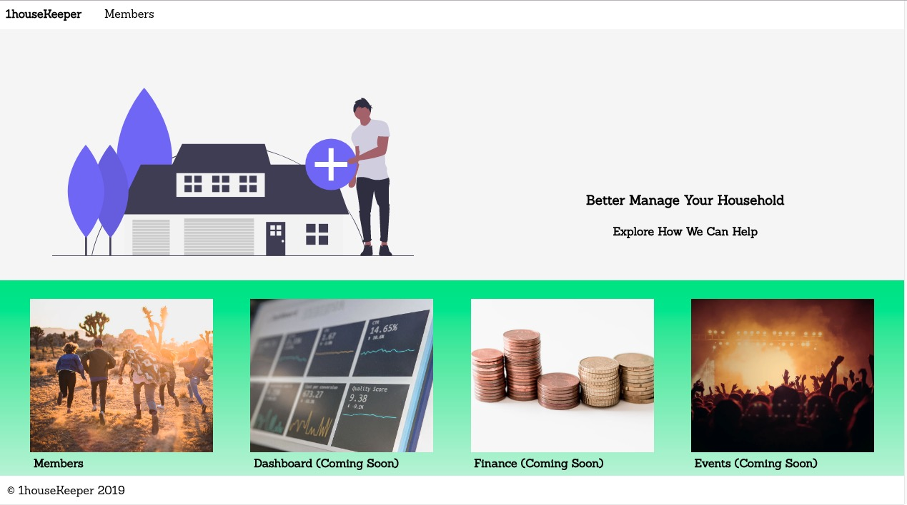

# 1housekeeper 

[Trello Board](https://trello.com/b/EQ3X5Z0G/1housekeeper)

**Demo:** [https://vibrant-bassi-ad96bd.netlify.com/](https://vibrant-bassi-ad96bd.netlify.com/)

Front End part of the 1houseKeeper app. It provides features that aim to help better household management.

---

**Knowledge Applied**

- **Front**: `HTML`, `CSS`, `React`, `React Router`, `Styled-Component`
- **Testing**: `Jest`
- **CI/CD**: `TravisCI`

---

**CI/CD**

- Continuous Integration is set up with [Travis CI](https://travis-ci.org/) on the master branch
- Upon passing all the tests, the master branch automatically deployed on [Heroku](https://onehousekeeper.herokuapp.com/).

**References**

- https://undraw.co/illustrations
